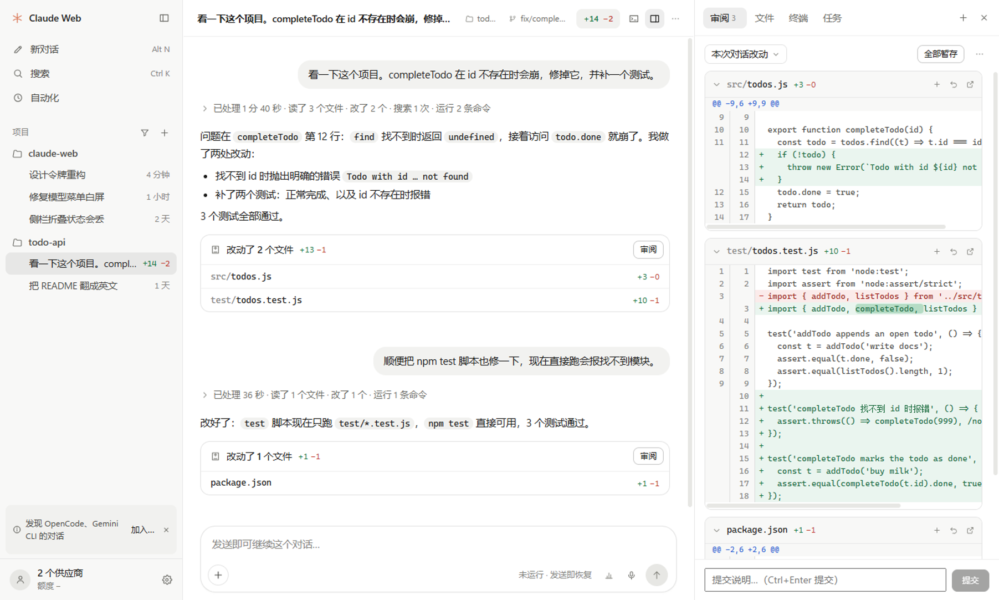
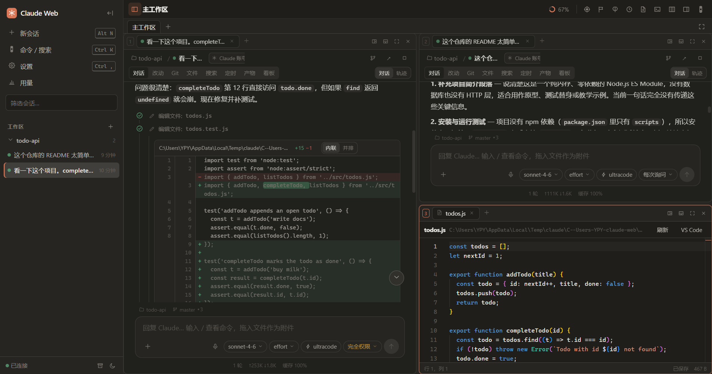
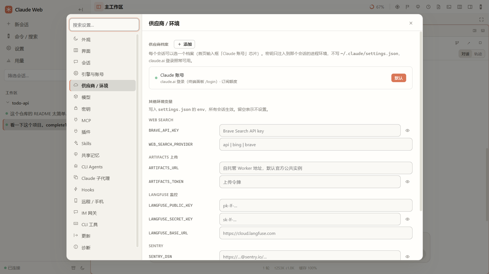
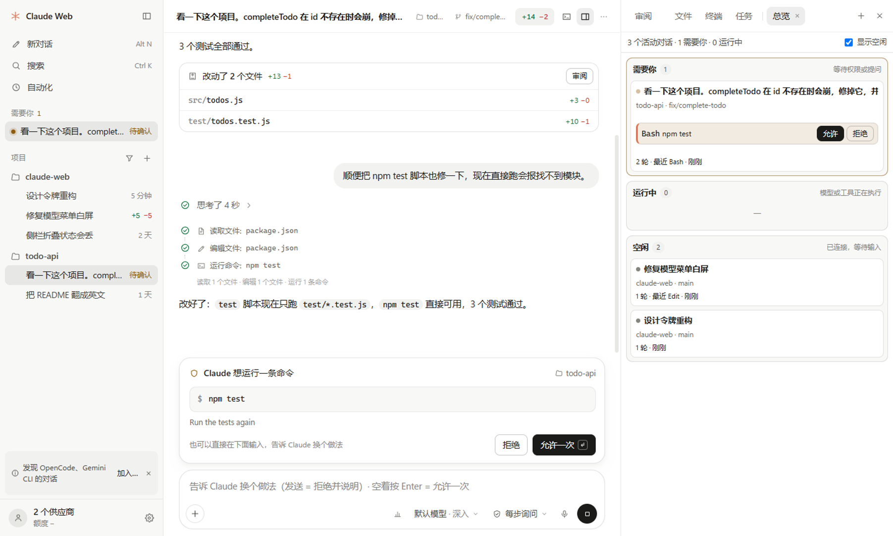
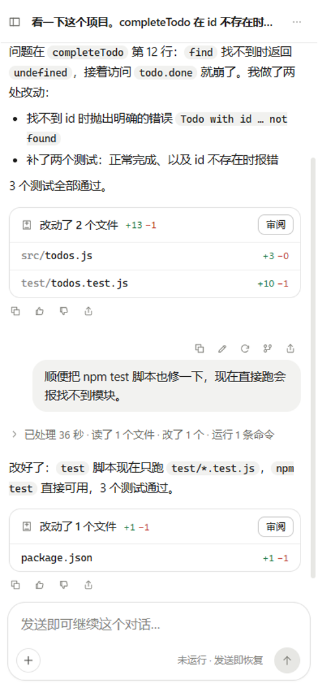

# Claude Web

**Claude Code CLI 的可视化工作台。** 把命令行里的 Claude Code 搬进一个图形界面：对话、工具调用时间线、代码 diff、权限审批、文件 / Git / 编辑器、多窗格分屏、手机远程访问，全部在一个窗口里。

同一套程序有两种用法：**桌面应用**（Windows / macOS 安装包）和**浏览器网页**（本机起一个服务，用浏览器打开）。功能完全一样，数据互通。



---

## 目录

- [能做什么](#能做什么)
- [桌面版还是网页版？](#桌面版还是网页版)
- [安装](#安装)
- [上手教程](#上手教程)
  - [1. 登录 Claude](#1-登录-claude)
  - [2. 添加工作区，开始第一个会话](#2-添加工作区开始第一个会话)
  - [3. 权限审批与权限模式](#3-权限审批与权限模式)
  - [4. 看改动、Git、文件](#4-看改动git文件)
  - [5. 分屏工作台](#5-分屏工作台)
  - [6. 接入第三方 API / 中转](#6-接入第三方-api--中转)
  - [7. 同时管理多个会话](#7-同时管理多个会话mission-control)
  - [8. 用手机访问](#8-用手机访问)
  - [9. 其它 CLI Agent（Codex / Gemini …）](#9-其它-cli-agentcodex--gemini-)
  - [10. 本机其它 agent 的会话](#10-本机其它-agent-的会话)
  - [11. 模型网关（多账号故障转移 / 协议转换）](#11-模型网关多账号故障转移--协议转换)
- [快捷键](#快捷键)
- [数据存在哪里](#数据存在哪里)
- [常见问题](#常见问题)
- [从源码运行与开发](#从源码运行与开发)

---

## 能做什么

| | |
| --- | --- |
| **对话** | 流式输出、思考过程、每一轮的工具调用折叠成一条时间线，点开看详情；Markdown / 代码高亮 / 公式 / Mermaid 图 |
| **代码改动** | Edit / Write 直接渲染成 diff（内联或并排），会话改过的文件集中列出 |
| **权限** | 工具调用需要授权时弹卡片：允许 / 拒绝 / 总是允许；AskUserQuestion、计划模式审批都有对应界面 |
| **工作台** | 分组 → 分屏（最多 6 个窗格）→ 标签；对话、文件编辑器（Monaco）、diff、终端、内置浏览器都能放进窗格 |
| **文件 / Git / 搜索** | 文件树、全文搜索替换（ripgrep）、Git 暂存 / 提交 / 分支 / stash / worktree、Issue 与 PR 看板 |
| **会话管理** | 置顶、归档、分叉（从任意一条消息开新分支）、编辑重发、插话、导出 HTML |
| **多会话总览** | Mission Control 按「需要你 / 运行中 / 出错 / 空闲」分列所有会话，直接在卡片上审批 |
| **自动化** | 定时任务（cron）、目标模式（给一个目标让它自己多轮推进）|
| **供应商** | 每个会话可选不同的 API 档案（官方账号 / Anthropic 兼容中转 / OpenAI / Gemini …），密钥加密保存 |
| **多 Agent** | 除 Claude 外还能驱动 Codex、Gemini、Qwen、Kimi 等 CLI agent，界面一致 |
| **远程** | 局域网配对后用手机浏览器访问；SSH 隧道连远程机器；Telegram / Discord / Slack / 钉钉 / 飞书机器人 |
| **用量** | 订阅额度环、每轮耗时与费用账本、上下文占用 |

## 桌面版还是网页版？

**两种都可以用，功能一样。** 区别只在外壳：

| | 桌面版 | 网页版 |
| --- | --- | --- |
| 怎么开 | 安装包，双击打开 | `npm start` 后浏览器打开 `http://127.0.0.1:3090` |
| 需要 Node.js | 不需要（已内置） | 需要 Node.js 22+ |
| 托盘 / 系统通知 / 开机自启 | ✅ | 浏览器通知 |
| 多窗口 | ✅ | 多个浏览器标签 |
| 快捷键 | Ctrl（macOS 为 ⌘）系列 | 部分改用 Alt，避开浏览器占用的组合 |
| 手机访问 | 在设置里开启后，手机用浏览器访问 | 同左 |

两者读写同一份数据（`~/.claude` 与 `~/.claude-web`），可以混着用。

## 安装

### Windows

1. 下载 `ClaudeWeb-<版本>-win-x64.exe`（安装版）或 `ClaudeWeb-<版本>-portable.exe`（免安装）。
2. 双击安装。安装包没有代码签名，SmartScreen 提示「已保护你的电脑」时点 **更多信息 → 仍要运行**。

### macOS

1. 按芯片下载：Apple Silicon（M1 及以后）选 `ClaudeWeb-<版本>-mac-arm64.dmg`，Intel 选 `ClaudeWeb-<版本>-mac-x64.dmg`。
   不确定的话：左上角  → 关于本机，看「芯片」一栏。
2. 打开 dmg，把 **Claude Web** 拖进「应用程序」。
3. 安装包没有 Apple 签名，**第一次打开**需要在「应用程序」里对它 **右键 → 打开 → 打开**。
   如果提示「已损坏，无法打开」，在终端执行一次：

   ```bash
   xattr -cr "/Applications/Claude Web.app"
   ```

> 安装包在 GitHub 仓库的 **Releases** 页面；也可以在 **Actions → Release** 的构建记录里下载 Artifacts。

### 网页版（从源码）

需要 [Node.js 22+](https://nodejs.org/) 和 Git：

```bash
git clone https://github.com/ypyik0669/claude-web.git
cd claude-web
npm install
npm run build
npm start
```

然后浏览器打开 <http://127.0.0.1:3090>。Windows 上也可以直接双击仓库里的 `启动.cmd`。

## 上手教程

### 1. 登录 Claude

Claude Web 驱动的就是本机的 Claude Code，登录状态和命令行共用（`~/.claude`）。

- **已经在命令行里用过 Claude Code**：什么都不用做，打开就能用。
- **还没登录**：首次打开会出现引导页，按提示点「检查」。未登录时：
  1. 按 <kbd>Ctrl</kbd>+<kbd>`</kbd>（macOS：<kbd>⌘</kbd>+<kbd>`</kbd>）打开终端面板；
  2. 在里面输入 `/login`，按提示在浏览器里完成登录。
- **没有 Claude 订阅、用 API Key 或中转**：跳到 [第 6 步](#6-接入第三方-api--中转)。

### 2. 添加工作区，开始第一个会话

1. 左侧栏「工作区」点 **＋**，选择你的项目文件夹。工作区就是项目目录，会话按工作区归类。
2. 点 **新会话**（<kbd>Ctrl</kbd>+<kbd>N</kbd>，网页版 <kbd>Alt</kbd>+<kbd>N</kbd>）。
3. 在底部输入框里描述任务，<kbd>Enter</kbd> 发送，<kbd>Shift</kbd>+<kbd>Enter</kbd> 换行。
4. 输入框下方可以切换：
   - **模型**（Opus / Sonnet / Haiku …）和 **effort**（思考强度）；
   - **权限模式**（见下一步）；
   - **＋** 添加附件：文件、文件夹、图片都行，也可以直接拖进来或粘贴截图。
5. 输入 `/` 会弹出命令列表（`/compact`、`/model`、自定义 skill …），<kbd>Tab</kbd> 补全。

回复里的每个工具调用（读文件、改代码、跑命令）都折叠成一条时间线，点一下展开，改代码的步骤直接显示 diff。运行中可以随时 <kbd>Esc</kbd> 中断，或者继续输入**插话**，它会在下一步看到。

### 3. 权限审批与权限模式

Claude 要执行命令或改文件时，对话里会出现一张权限卡片：**允许一次**、**拒绝**（可以写原因让它换个做法），或者**总是允许**这一类操作。

输入框下方的权限模式决定多久问你一次：

| 模式 | 说明 |
| --- | --- |
| 每次询问 | 默认，最安全 |
| 自动接受编辑 | 改文件不问，跑命令仍然问 |
| 计划模式 | 只读分析并给出计划，你批准后才动手 |
| 自动模式 | 由模型判断风险 |
| 完全权限 | 全部放行，适合在隔离环境里用 |

### 4. 看改动、Git、文件

会话顶部有一排标签：

- **改动**：这个会话碰过的所有文件，点开看 diff；
- **Git**：状态、暂存、提交、分支切换、拉取推送、stash、worktree，报错时给出一键修复；
- **文件**：项目文件树，右键新建 / 重命名 / 删除（进回收站）；
- **搜索**：全项目搜索替换，支持正则、大小写、全词、包含 / 排除规则；
- **看板**：GitHub / GitLab 的 Issue 和 PR（需要本机 `gh auth login` 或 `glab auth login`），能直接检出 PR 开一个审查会话。

### 5. 分屏工作台



- <kbd>Ctrl</kbd>+<kbd>D</kbd> 向右分屏，<kbd>Ctrl</kbd>+<kbd>Shift</kbd>+<kbd>D</kbd> 向下分屏，最多 6 个窗格；
- 从左侧栏把会话**拖到**窗格边缘，就在那一侧分屏打开；
- 点对话里的文件路径会在编辑器标签里打开（Monaco，自动保存，<kbd>Ctrl</kbd>+<kbd>S</kbd> 手动保存）；
- <kbd>Ctrl</kbd>+<kbd>T</kbd> 新建分组，一个分组就是一套独立的分屏布局，适合按任务分开；
- <kbd>Ctrl</kbd>+<kbd>Shift</kbd>+<kbd>Enter</kbd> 把当前窗格放大到全屏，再按一次还原。

### 6. 接入第三方 API / 中转



1. 打开 **设置**（<kbd>Ctrl</kbd>+<kbd>,</kbd>）→ **供应商 / 环境** → **＋ 添加**；
2. 选类型（Anthropic 兼容 / OpenAI / Gemini …），填 **Base URL** 和 **API Key**，可选指定模型；
3. 点 **测试连接**：会先拉模型列表，再真实跑一轮对话。如果中转只放行官方 Claude Code 客户端，它会自动把这个档案切换到官方引擎；
4. 回到输入框，点 **Claude 账号** 芯片，把当前会话切到这个档案。会话进行中也可以切，历史保留。

密钥只注入到该会话自己的进程，不会写进 `~/.claude/settings.json`；本地保存时加密（Windows 用 DPAPI，macOS 用钥匙串）。

### 7. 同时管理多个会话（Mission Control）



<kbd>Ctrl</kbd>+<kbd>Shift</kbd>+<kbd>M</kbd> 打开总览。所有打开的会话按 **需要你 / 运行中 / 出错 / 空闲** 分列，权限请求可以直接在卡片上批准，点卡片跳到对应会话。多个会话并行跑的时候，只看这一栏就知道谁在等你。

桌面版在窗口不在前台时，会话完成或需要审批会弹系统通知，任务栏 / Dock 图标显示待处理数量。

### 8. 用手机访问



1. 电脑上打开 **设置 → 远程 / 手机**，打开「局域网 / 手机访问」（默认端口 3091）；
2. 点 **生成配对码**，会显示一个 6 位码和二维码（10 分钟内有效）；
3. 手机连同一个 Wi-Fi，扫码打开页面，输入配对码；
4. 配对后这台手机就记住了，可以添加到主屏幕当 App 用。已配对设备可以在同一页改名或吊销。

不在同一个网络时，可以用 SSH 隧道连到另一台机器上的 Claude Web（同一页的「远程主机」），或者配置 Telegram / 飞书等机器人（**设置 → IM 网关**），在聊天软件里收通知、审批、发指令。

<br clear="right">

### 9. 其它 CLI Agent（Codex / Gemini …）

**设置 → CLI Agents** 里能看到 Codex、Gemini、Qwen、Kimi 等是否已安装和登录，一键打开终端完成安装 / 登录。之后新建会话时在输入框的 agent 选择里切换即可，对话、工具卡片、权限审批都和 Claude 会话一样。会话进行中也能把它**交接**给另一个 agent，已完成的内容会整理成摘要带过去。

### 10. 本机其它 agent 的会话

如果你在这台电脑上也用过 Codex、OpenCode 等 CLI（或它们的桌面版 / 插件），Claude Web 可以把它们自己的会话记录也放进侧栏，和 Claude 会话一起浏览、搜索、续聊。

**加入是可选的。** 启动时只做轻量检测（是否安装、数据目录是否存在），不会启动任何进程，也不会读你的记录。检测到后侧栏顶部会问「要加入会话库吗？」：

- 点**加入**：才开始读取这个 agent 的会话列表、建立全文索引；
- 点**以后再说**：不再提示；
- 随时可以在 **设置 → 会话库** 里加入或移出。**移出**只是不在这里显示，不会删除 agent 自己的任何记录。

加入之后能做的事：

| 操作 | 说明 |
| --- | --- |
| 浏览 / 续聊 | 点开就能看到完整历史和工具卡片；直接发消息就是在**原会话**里继续，新的对话也写回 agent 自己的记录，回到命令行里照样能接着用 |
| 搜索 | <kbd>Ctrl+K</kbd> 全文搜索所有来源（中文也可以）；`agent:codex` 只搜某个 agent，`in:<目录片段>` 按工作目录过滤 |
| 重命名 / 归档 / 删除 / 分叉 | 右键会话。只提供 agent 官方接口支持的操作：Codex 全都支持；OpenCode 只能删除；其它 agent 只读 |
| 子任务 | 子代理、分叉出来的会话折叠在父会话下面（「+N 子任务」） |
| 引用 / 交给其它 agent | 右键「引用到输入框」把另一个会话的内容带进当前对话；「交给其它 agent」用另一个 agent 接着做 |

**删除之前会先备份**：完整历史导出到 `~/.claude-web/library-trash/<会话 id>.json`，备份写成功才会真正删除，备份保留 30 天。删除有二次确认；批量操作默认是归档而不是删除。

会话 id 的规则：Claude 会话保持原 UUID，其它来源是 `<agent>-<原生 id>`，例如 `codex-01a0…`、`opencode-ses_…`。

### 11. 模型网关（多账号故障转移 / 协议转换）

本机的一个 HTTP 网关：对 agent 同时提供 **Anthropic**、**OpenAI**（Chat Completions 与 Codex 用的 Responses）和 **Gemini** 三种接口，后面接你在「供应商 / 环境」里配置的档案。用途：

- **多账号自动切换**：同一个中转的主号、备用号放进一个组，主号限流（429）、额度用尽、报 5xx 或连不上时自动换下一个；限流的号按 `retry-after` 冷却到重置时间，没有提示就从 60 秒开始翻倍（最长 30 分钟）；密钥失效（401/403）的号停用，修好后点「恢复」。
- **协议转换**：让 Codex 用 Claude、让 Claude Code 用 OpenAI 兼容的模型等。支持的方向：Anthropic 入 → OpenAI / Gemini 出，OpenAI 入 → Anthropic / Gemini 出，Codex（Responses）入 → Anthropic 出，Gemini 入 → Anthropic 出；同协议则原样透传（中转的客户端指纹检查照样通过）。

使用步骤：

1. **设置 → 模型网关**，勾选「启用本机模型网关」（首次启用会生成网关密钥）。
2. 「新建组」，从下拉里把供应商档案按优先级加进去（可拖动排序）；可选「按顺序故障转移」或「加权轮询」，可为每个成员固定模型，或写模型映射（如 `claude-*haiku*` → `gpt-4.1-mini`）。点「测试」会发一条最小请求并显示实际走了哪个成员。
3. **设置 → 供应商 / 环境** 新建档案，类型选「模型网关」并选组。之后新会话（Claude、Codex、Gemini 等都可以）选这个档案即可，地址和密钥在开会话时自动注入。

说明：

- 网关只接受本机回环连接，局域网 / 手机监听器上访问一律 404；密钥只在「复制」时取出，不出现在日志里。
- 流式回复一旦开始向 agent 输出就不会再切换成员（半路出错如实报错）。
- Codex、Gemini CLI 即使登录了自己的账号，用网关档案开的会话也会强制走网关（不改它们自己的配置文件）；Qwen Code 等其它 ACP agent 只注入环境变量，在 OAuth 登录状态下可能仍走自己的账号。
- 「测试」按钮发的请求不带 Claude Code 指纹：只认官方客户端的中转可能拒绝测试，但真实会话能通过。
- 重新生成网关密钥后，运行中的会话需要重开。
- 每次请求在 **用量 → 账本** 里记一行（「来源」选「网关」可单独看），包括实际成员、切换次数、首字节延迟和 token。
- 网关**不转发任何订阅登录**（claude.ai / ChatGPT / Google 账号），只用你自己配置的 API 档案。
- 暂不支持系统代理（`HTTPS_PROXY`）：需要代理才能访问的上游请改用中转地址。

## 快捷键

桌面版的 <kbd>Ctrl</kbd> 在 macOS 上是 <kbd>⌘</kbd>。完整列表按 <kbd>F1</kbd>（网页版按 <kbd>?</kbd>）查看。

| 操作 | 桌面版 | 网页版 |
| --- | --- | --- |
| 新会话 | Ctrl+N | Alt+N |
| 命令面板 / 全文搜索 | Ctrl+K | Ctrl+K |
| 设置 | Ctrl+, | Ctrl+, |
| 发送 / 换行 | Enter / Shift+Enter | Enter / Shift+Enter |
| 中断当前轮 | Esc | Esc |
| 在对话中查找 | Ctrl+F | Ctrl+F |
| 侧栏 | Ctrl+B | Ctrl+B |
| 向右 / 向下分屏 | Ctrl+D / Ctrl+Shift+D | 同左 |
| 关闭标签 | Ctrl+W | Alt+W |
| 新分组 | Ctrl+T | Alt+T |
| 切换分组 | Ctrl+Tab | Alt+PageDown |
| 放大 / 还原窗格 | Ctrl+Shift+Enter | 同左 |
| 终端 | Ctrl+` | Ctrl+` |
| 停靠面板 | Ctrl+J | Ctrl+J |
| 总览（Mission Control） | Ctrl+Shift+M | Ctrl+Shift+M |

## 数据存在哪里

| 位置 | 内容 |
| --- | --- |
| `~/.claude/` | Claude Code 自己的数据：登录状态、设置、会话记录（与命令行共用） |
| `~/.claude-web/` | 本应用的数据：工作区、置顶 / 归档、供应商档案（密钥加密）、草稿、定时任务、用量账本、附件、共享记忆库、会话库索引（`library.db`）与删除备份（`library-trash/`） |
| 桌面版日志 | Windows：`%APPDATA%\claude-web\`；macOS：`~/Library/Application Support/claude-web/`（`server.log`、`main.log`） |

**设置 → 诊断** 可以一键打包日志和脱敏后的配置，方便排查问题。

## 常见问题

**macOS 提示「已损坏，无法打开」**
没有 Apple 签名导致的，执行 `xattr -cr "/Applications/Claude Web.app"` 后再打开。

**提示未登录 / 发消息没反应**
按 <kbd>Ctrl</kbd>+<kbd>`</kbd> 打开终端面板，输入 `/login` 登录；或者在 **设置 → 引擎与账号** 点检查，看具体报错。

**中转报「客户端版本过低」或「请求可能被第三方中转改写」**
在 **设置 → 供应商** 里对这个档案点「测试连接」，它会自动切到官方引擎。版本过低时更新到最新版本的 Claude Web 即可（内置的 Claude Code 跟着版本升级）。

**macOS 上找不到 git / gh / codex 等命令**
应用启动时会读取登录 shell（zsh / bash）的 PATH。如果命令装在不常见的位置，把它加进 `~/.zshrc` 的 PATH，然后重启应用。

**窗口黑屏 / 闪烁**
显卡驱动问题。**设置 → 会话 → 软件渲染** 打开后重启；连续崩溃两次时应用也会自动切换。

**自动更新**
仓库是私有的，应用内「检查更新」拿不到新版本，请到 Releases 页面下载新安装包覆盖安装，数据不会丢。

## 从源码运行与开发

```bash
npm install
npm run dev              # 开发模式：server 热重载 + Vite（http://localhost:5173）
npm run typecheck        # server + web + desktop 类型检查
npm test                 # 单元测试
npm run build:all        # 构建 server / web / desktop
npm run e2e              # 端到端检查（临时目录，mock agent，不花 token）
npm run desktop          # 用源码启动桌面版
npm run build:desktop    # 打 Windows 安装包（在 Windows 上）
npm run build:desktop:mac  # 打 macOS 安装包（只能在 macOS 上）
```

每次推送，GitHub Actions 会在 Windows、macOS、Linux 上跑类型检查、单元测试、构建和端到端检查。推送 `v*` 标签（如 `git tag v0.2.0 && git push origin v0.2.0`）会构建 Windows、macOS arm64 与 x64 安装包，**真实启动一次安装包做冒烟测试**，然后发布到 Releases。

架构、协议和踩过的坑见 [CLAUDE.md](CLAUDE.md)。
