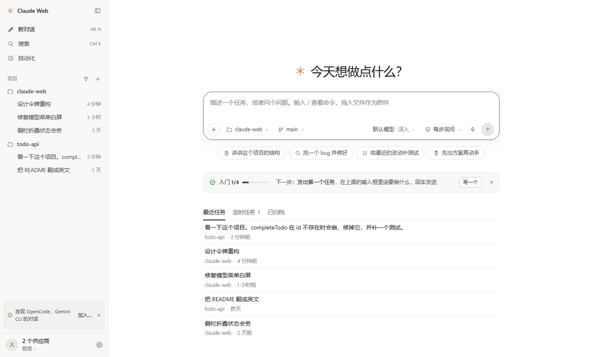
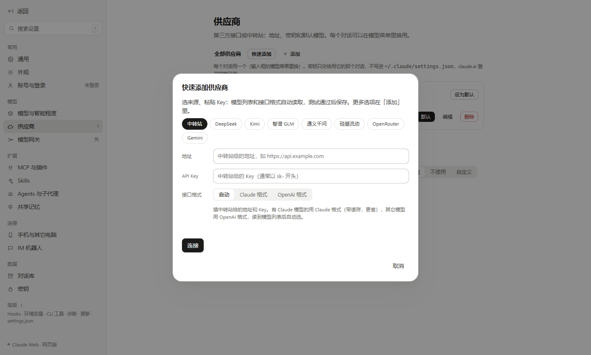
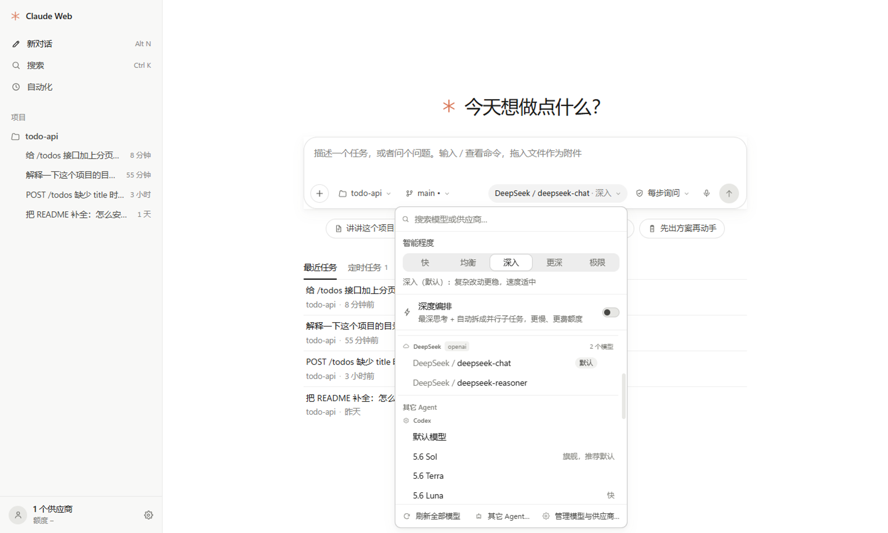
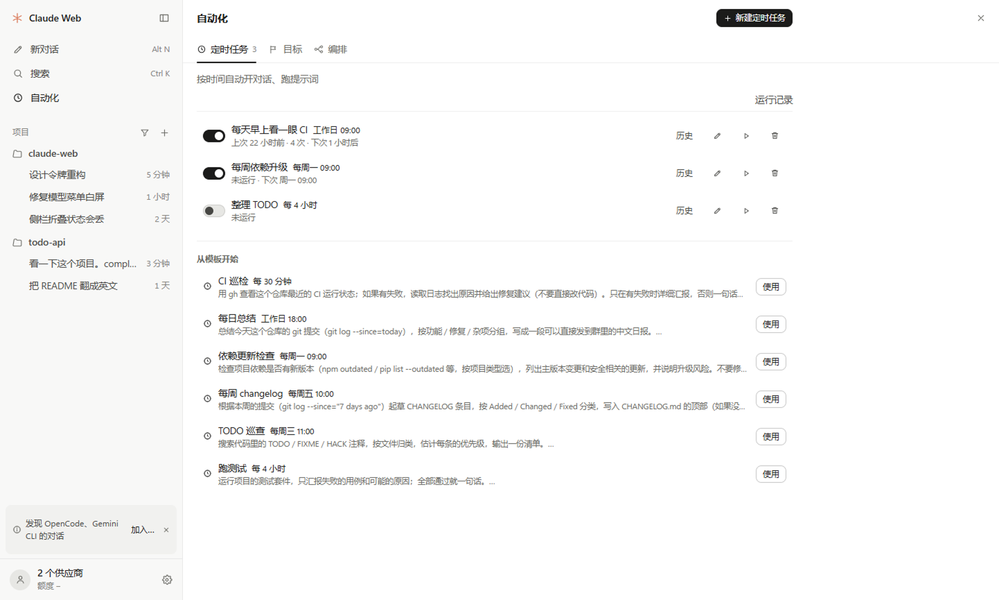

# Claude Web

**Claude Code CLI 的可视化工作台。** 把命令行里的 Claude Code 搬进一个图形界面：对话、每一轮折叠成一行的工具调用、代码 diff 审阅、权限审批、文件 / Git / 编辑器、分屏、手机远程访问，全部在一个窗口里。

同一套程序有两种用法：**桌面应用**（Windows / macOS）和**浏览器网页**（本机起一个服务，用浏览器打开）。功能完全一样，数据互通。除了 Claude Code，也能用同一个界面驱动 Codex、Gemini CLI、Qwen Code、Kimi、OpenCode 等 CLI agent。

> **非官方项目。** Claude Web 是社区开发的开源工具，与 Anthropic 没有任何关联，也没有得到 Anthropic 的认可。「Claude」「Claude Code」是 Anthropic 的商标。使用它需要你自己的 Claude Code 登录（Claude 订阅）或第三方 API / 中转的密钥，费用和用量按你自己的账号计算。


---

## 目录

- [能做什么](#能做什么)
- [桌面版还是网页版？](#桌面版还是网页版)
- [安装](#安装)
- [上手教程](#上手教程)
  - [1. 登录 Claude](#1-登录-claude)
  - [2. 选一个项目，开始第一个对话](#2-选一个项目开始第一个对话)
  - [3. 权限审批与权限模式](#3-权限审批与权限模式)
  - [4. 审阅改动、Git、文件：右侧面板](#4-审阅改动git文件右侧面板)
  - [5. 分屏工作台](#5-分屏工作台)
  - [6. 接入第三方 API / 中转](#6-接入第三方-api--中转)
  - [7. 同时管理多个对话](#7-同时管理多个对话)
  - [8. 用手机访问](#8-用手机访问)
  - [9. 其它 CLI Agent（Codex / Gemini …）](#9-其它-cli-agentcodex--gemini-)
  - [10. 本机其它 agent 的对话](#10-本机其它-agent-的对话)
  - [11. 模型网关（多账号故障转移 / 协议转换）](#11-模型网关多账号故障转移--协议转换)
  - [12. 其它 agent 的配置（MCP / 说明文件 / 模型）](#12-其它-agent-的配置mcp--说明文件--模型)
  - [13. 其它机器上的对话](#13-其它机器上的对话)
  - [14. 自动化：定时任务、目标、多 agent 编排](#14-自动化定时任务目标多-agent-编排)
- [快捷键](#快捷键)
- [数据存在哪里](#数据存在哪里)
- [常见问题](#常见问题)
- [工作原理](#工作原理)
- [安全与隐私](#安全与隐私)
- [从源码运行与开发](#从源码运行与开发)
- [参与贡献](#参与贡献)
- [许可证与致谢](#许可证与致谢)

---

## 能做什么

| | |
| --- | --- |
| **对话** | 流式输出、思考过程；做完的一轮折成一行「已处理 27 秒 · 读了 2 个文件 · 运行 1 条命令」，点开是逐步的时间线；Markdown / 代码高亮 / 公式 / Mermaid 图 |
| **代码改动** | 每轮末尾「改动了 N 个文件」卡片，右侧面板「审阅」逐文件看 diff（上下或并排）、暂存、还原、提交 |
| **权限** | 需要授权时卡片停在输入框上方：允许一次（空着按 Enter）/ 拒绝（输入框里的字就是理由）/ 总是允许；提问、计划审批也在这里 |
| **工作台** | 默认只有侧栏 · 对话 · 右侧面板；需要时 Ctrl+D 分屏（最多 6 个）、开标签页、分组；对话、编辑器（Monaco）、diff、终端、内置浏览器都能放进分屏 |
| **文件 / Git / 搜索** | 文件树、全文搜索替换（ripgrep）、Git 暂存 / 提交 / 分支 / stash / worktree、Issue 与 PR 看板 |
| **对话管理** | 置顶、归档、分叉（从任意一条消息开新分支）、编辑重发、插话、导出 HTML |
| **需要你** | 侧栏顶上列出所有等你确认 / 回答的对话；总览（Mission Control）按「需要你 / 运行中 / 出错 / 空闲」分列 |
| **自动化** | 定时任务（cron）、目标（给一个目标让它自己多轮推进）、多 agent 编排，在侧栏「自动化」一页里 |
| **供应商** | 每个对话可选不同的供应商（官方账号 / Anthropic 兼容中转 / OpenAI / Gemini …），模型菜单里「供应商 / 模型」平铺一列；密钥加密保存 |
| **多 Agent** | 除 Claude 外还能驱动 Codex、Gemini、Qwen、Kimi 等 CLI agent，界面一致 |
| **远程** | 局域网配对后用手机浏览器访问；SSH 隧道连远程机器；Telegram / Discord / Slack / 钉钉 / 飞书机器人 |
| **用量** | 订阅额度环、每轮耗时与费用账本、上下文占用 |

## 桌面版还是网页版？

**两种都可以用，功能一样。** 区别只在外壳：

| | 桌面版 | 网页版 |
| --- | --- | --- |
| 怎么开 | 安装包，双击打开 | `npm start` 后浏览器打开 `http://127.0.0.1:3090` |
| 需要 Node.js | 不需要（已内置） | 需要 Node.js 22.13+ |
| 托盘 / 系统通知 / 开机自启 | ✅ | 浏览器通知 |
| 多窗口 | ✅ | 多个浏览器标签 |
| 快捷键 | Ctrl（macOS 为 ⌘）系列 | 部分改用 Alt，避开浏览器占用的组合 |
| 手机访问 | 在设置里开启后，手机用浏览器访问 | 同左 |

两者读写同一份数据（`~/.claude` 与 `~/.claude-web`），可以混着用。

## 安装

### 桌面版（下载安装包）

到 [Releases](https://github.com/ypyik0669/claude-web/releases/latest) 下载：

| 系统 | 文件 |
| --- | --- |
| Windows 10 / 11（x64） | `ClaudeWeb-<版本>-win-x64.exe`（安装版）或 `ClaudeWeb-<版本>-portable.exe`（免安装） |
| macOS，Apple Silicon（M1 及以后） | `ClaudeWeb-<版本>-mac-arm64.dmg` |
| macOS，Intel | `ClaudeWeb-<版本>-mac-x64.dmg` |

`.zip`、`.yml`、`.blockmap` 是自动更新用的，不用下载。第一次打开的提示见下面「安装包的提示」。每个版本改了什么见 [更新日志](CHANGELOG.md)。

### 网页版（从源码）

需要 [Node.js 22.13+](https://nodejs.org/)（用到内置的 `node:sqlite`）和 Git：

```bash
git clone https://github.com/ypyik0669/claude-web.git
cd claude-web
npm install
npm run build
npm start
```

然后浏览器打开 <http://127.0.0.1:3090>。Windows 上也可以直接双击仓库里的 `启动.cmd`。

### 桌面版（自己打包）

```bash
npm install
npm run build:desktop        # Windows：dist-desktop/ClaudeWeb-<版本>-win-x64.exe（安装版）和 -portable.exe（免安装）
npm run build:desktop:mac    # macOS：只能在 Mac 上打，arm64 / x64 各在对应芯片的机器上打
npm run build:desktop:linux  # Linux
```

### 安装包的提示

- **Windows**：安装包没有代码签名，SmartScreen 提示「已保护你的电脑」时点 **更多信息 → 仍要运行**。
- **macOS**：按芯片选包，Apple Silicon（M1 及以后）是 `mac-arm64.dmg`，Intel 是 `mac-x64.dmg`（左上角  → 关于本机，看「芯片」一栏）。打开 dmg，把 **Claude Web** 拖进「应用程序」。安装包没有 Apple 签名，**第一次打开**需要在「应用程序」里对它 **右键 → 打开 → 打开**；如果提示「已损坏，无法打开」，在终端执行一次：

  ```bash
  xattr -cr "/Applications/Claude Web.app"
  ```

## 上手教程

### 1. 登录 Claude

Claude Web 驱动的就是本机的 Claude Code，登录状态和命令行共用（`~/.claude`）。

- **已经在命令行里用过 Claude Code**：什么都不用做，打开就能用。
- **还没登录**：首次打开的引导只有两步——① 登录（已经登录或已经配了供应商就自动跳过）② 选一个项目文件夹。登录这一步点 **在终端登录**：会开一个终端标签，里面就是 Claude Code，按提示选登录方式（或输入 `/login`），登录好回到引导点 **重新检查**。也可以 **先跳过**，以后首页顶上会提示你还没登录。
- **没有 Claude 订阅、用 API Key 或中转**：引导里点 **添加供应商**，或跳到 [第 6 步](#6-接入第三方-api--中转)。

### 2. 选一个项目，开始第一个对话



1. 首页输入框左下的 **项目** 里选你的项目文件夹（最近用过的列在最上，「打开文件夹…」选别的）。侧栏按项目归类对话；「项目」标题行的 **＋** 也能加项目。
2. 在输入框里描述任务，<kbd>Enter</kbd> 发送，<kbd>Shift</kbd>+<kbd>Enter</kbd> 换行。之后侧栏 **新对话**（<kbd>Ctrl</kbd>+<kbd>N</kbd>，网页版 <kbd>Alt</kbd>+<kbd>N</kbd>）回到这里。
3. 输入框是一行：
   - **＋**：添加文件、文件夹、图片（也可以直接拖进来或粘贴截图），引用另一个对话，设定一个目标，以及浏览器 / 操控电脑等能力开关；
   - **项目 · 分支**（只在新对话里）：切项目、切本地分支，或让它在独立副本（git worktree）里做；
   - **模型**：芯片上是「模型 · 智能程度」（如 `Sonnet 5 · 深入`），菜单顶上调智能程度（快 / 均衡 / 深入 / 更深 / 极限），下面是全部供应商的模型；
   - **权限**（见下一步）；右下角的小环是上下文占用，悬停看本对话的用量。
4. 输入 `/` 会弹出命令列表（`/compact`、`/model`、自定义 skill …），<kbd>Tab</kbd> 补全。

回复在进行时逐步展开每个工具调用（读文件、改代码、跑命令）；这一轮做完就折成一行摘要，点开是完整的时间线，改动在末尾的「改动了 N 个文件」卡片里，点文件就在右侧审阅。运行中可以随时 <kbd>Esc</kbd> 中断，或者继续输入**插话**，它会在下一步看到。

### 3. 权限审批与权限模式

Claude 要执行命令或改文件时，输入框上方会停一张卡片（消息流里那一步显示「等你确认」）：**允许一次**（输入框空着时按 <kbd>Enter</kbd>）、**拒绝**（在输入框里写原因再按 <kbd>Enter</kbd>，它会换个做法），或者**总是允许**这一类操作。卡片刚出现的一瞬间按下的 <kbd>Enter</kbd> 不算数，免得误批。计划卡要点按钮或 <kbd>Ctrl</kbd>+<kbd>Enter</kbd>。

输入框右下的权限决定多久问你一次（**设置 → 通用 → 默认权限** 设新对话的默认值）：

| 模式 | 说明 |
| --- | --- |
| 每步询问 | 改文件、运行命令之前都先问你（推荐） |
| 自动改文件 | 直接改文件；运行命令之前问你 |
| 只做计划 | 先读代码、写方案，你点头后才动手 |
| 自动判断 | Claude 自己判断哪些操作需要问你 |
| 只做已允许的 | 不弹确认；没事先允许的操作一律跳过 |
| 完全放开 | 什么都不问直接执行，只在可以随便弄坏的环境里用 |

### 4. 审阅改动、Git、文件：右侧面板

对话顶上一行是标题、项目、分支，右边是 **+N −M**（这个对话改了多少行，点它打开审阅）、终端、右侧面板（<kbd>Ctrl</kbd>+<kbd>J</kbd>）和 **···**。右侧面板有四个固定标签：

- **审阅**：未提交的改动 / 已暂存 / 本次对话改动 / 最近某次提交，逐文件看 diff，暂存、还原、写提交说明并提交；··· 里的 **Git** 是分支、拉取推送、历史、stash、worktree，报错时给出一键修复；
- **文件**：项目文件树（右键新建 / 重命名 / 移到回收站）和全项目搜索替换（正则、大小写、全词、包含 / 排除），本对话生成的文件列在最上；
- **终端**：隐藏面板时终端照常在后台运行；
- **任务**：这个对话的后台任务、计划清单和子代理。

右侧面板的 **＋** 里还有目标、编排、用量、详情和 **Issue 与 PR**（GitHub / GitLab 看板，需要本机 `gh auth login` 或 `glab auth login`，能直接检出 PR 开一个审查对话）。对话头的 **···** 列出所有视图，命令面板（<kbd>Ctrl</kbd>+<kbd>K</kbd>）也能搜到。

### 5. 分屏工作台


默认界面只有侧栏 · 对话 · 右侧面板，分屏、标签页、分组这些工作台工具用到时才出现：

- <kbd>Ctrl</kbd>+<kbd>D</kbd> 向右分屏，<kbd>Ctrl</kbd>+<kbd>Shift</kbd>+<kbd>D</kbd> 向下分屏，最多 6 个分屏；分屏后每个分屏顶上出现标签条，关到只剩一个又收起来；
- 从左侧栏把对话**拖到**分屏边缘，就在那一侧打开；
- 点对话里的文件路径会在编辑器标签里打开（Monaco，自动保存，<kbd>Ctrl</kbd>+<kbd>S</kbd> 手动保存）；
- <kbd>Ctrl</kbd>+<kbd>T</kbd> 新建分组，一个分组就是一套独立的分屏布局，适合按任务分开；
- <kbd>Ctrl</kbd>+<kbd>Shift</kbd>+<kbd>Enter</kbd> 把当前分屏放大，再按一次还原；
- 想让标签条、分组栏和右侧的面板图标栏一直显示：**设置 → 通用 → 显示工作台工具**。

### 6. 接入第三方 API / 中转

**最快的方法**：设置 → 供应商 → **快速添加**（首次打开时的「接一个模型」也是它）。选来源（中转站 / DeepSeek / Kimi / 智谱 / 通义 / 硅基流动 / OpenRouter / Gemini），中转站再填个地址，粘上 API Key，点 **连接**。模型列表和接口格式会自动读出来，测试通过才保存；Key 不对、余额不足、地址不对都会直接说明。



需要更多选项（指定模型映射、运行方式、缓存设置）时用完整表单：


1. 打开 **设置**（<kbd>Ctrl</kbd>+<kbd>,</kbd>）→ **供应商** → **＋ 添加**；
2. 选类型（Anthropic 兼容 / OpenAI / Gemini …），填 **Base URL** 和 **API Key**，可选指定模型；
3. 点 **测试连接**：会先拉模型列表，再真实跑一轮对话。如果中转只放行官方 Claude Code 客户端，它会自动让这个供应商改用官方 Claude Code 运行；
4. 回到输入框，点模型芯片，在菜单里选这个供应商的某个模型（芯片显示为 `供应商 / 模型`）。对话进行中也可以切，历史保留。

密钥只注入到该对话自己的进程，不会写进 `~/.claude/settings.json`；本地保存时加密（Windows 用 DPAPI，macOS 用钥匙串）。

**多个中转 / 账号一起用**：模型芯片是一个统一菜单，所有供应商的所有模型摊平成 `供应商 / 模型` 一列（官方账号的模型直接显示名字，如 `Fable 5.1`），选一项就同时切换供应商和模型：



- 顶部是智能程度和（支持的模型上）深度编排开关；搜索框按供应商名或模型名过滤，<kbd>↑</kbd> <kbd>↓</kbd> 选择、<kbd>Enter</kbd> 确认、<kbd>Esc</kbd> 关闭；
- 行尾的星标收藏，收藏的模型置顶；最近用过的 5 个单独一节；
- 每个供应商一节，节头显示模型数和上次拉取时间，拉取失败时显示错误；其它 agent（Codex、Gemini …）也各是一节；
- 底部「刷新全部模型」对每个供应商请求一次 `/v1/models`（只列模型，不跑对话、不花 token），启动后也会在后台刷新超过 24 小时的列表；「管理模型与供应商…」打开 **设置 → 模型与智能程度**；
- 菜单只列当前 agent 能用的供应商：Claude Code 全部类型都行，Codex 和其它 ACP agent 用 OpenAI 兼容 / 模型网关，Gemini CLI 用 Gemini / 模型网关；
- 对话里选同一供应商的模型直接切模型；选别的供应商会无感重启对话进程（历史保留）并直接用选中的模型；选另一个 agent 的模型就是把对话交给它继续。其它机器上的对话只能换模型。

**设置 → 模型与智能程度** 有两种视图：「按模型」是一张表，每个模型一行，列出提供它的供应商（点供应商芯片可把它设为该供应商的默认模型）、收藏星标和显示开关；「按供应商」是分组视图。顶部是每个供应商的拉取状态和单独刷新按钮。

### 7. 同时管理多个对话

侧栏最上面的 **需要你** 列出所有在等你确认权限、回答问题或审批编排的对话，点一下就过去；每一行对话的末尾是它的状态（待确认 / 运行中 / 出错 / 改了多少行）。


<kbd>Ctrl</kbd>+<kbd>Shift</kbd>+<kbd>M</kbd>（或命令面板里的「总览」）在右侧面板打开总览：所有打开的对话按 **需要你 / 运行中 / 出错 / 空闲** 分列，权限请求可以直接在卡片上批准，点卡片跳到对应对话。

桌面版在窗口不在前台时，对话完成或需要审批会弹系统通知，任务栏 / Dock 图标显示待处理数量。

### 8. 用手机访问


1. 电脑上打开 **设置 → 手机与其它电脑**，打开「局域网 / 手机访问」（默认端口 3091）；
2. 点 **生成配对码**，会显示一个 6 位码和二维码（10 分钟内有效）；
3. 手机连同一个 Wi-Fi，扫码打开页面，输入配对码；
4. 配对后这台手机就记住了，可以添加到主屏幕当 App 用。已配对设备可以在同一页改名或吊销。

手机上侧栏是左边的抽屉（☰），右侧面板（审阅、终端、任务…）是从底部拉起的抽屉，从对话头的 ··· 打开。

不在同一个网络时，可以用 SSH 隧道连到另一台机器上的 Claude Web（同一页的「更多选项」），或者配置 Telegram / 飞书等机器人（**设置 → IM 机器人**），在聊天软件里收通知、审批、发指令。

<br clear="right">

### 9. 其它 CLI Agent（Codex / Gemini …）

**设置 → Agents 与子代理 → 其它 Agent** 里能看到 Codex、Gemini、Qwen、Kimi 等是否已安装和登录，一键打开终端完成安装 / 登录。之后在模型菜单里选它们的模型即可（每个 agent 一节），对话、工具卡片、权限审批都和 Claude 一样。对话进行中也能把它**交接**给另一个 agent（对话头 ··· →「交给其它 Agent 继续」），已完成的内容会整理成摘要带过去。

### 10. 本机其它 agent 的对话

如果你在这台电脑上也用过 Codex、OpenCode 等 CLI（或它们的桌面版 / 插件），Claude Web 可以把它们自己的对话记录也放进侧栏，和 Claude 的对话一起浏览、搜索、续聊。

**加入是可选的。** 启动时只做轻量检测（是否安装、数据目录是否存在），不会启动任何进程，也不会读你的记录。检测到后侧栏底部会出一行「把 Codex 里的对话也列在这里？」（首页的入门清单做完或关掉之后才出现，最多等 3 天）：

- 点**列出来**：才开始读取这个 agent 的对话列表、建立全文索引；
- 点 **×**（以后再说）：不再提示；
- 随时可以在 **设置 → 对话库** 里加入或移出。**移出**只是不在这里显示，不会删除 agent 自己的任何记录。

加入之后能做的事：

| 操作 | 说明 |
| --- | --- |
| 浏览 / 续聊 | 点开就能看到完整历史和工具卡片；直接发消息就是在**原来的对话**里继续，新的一轮也写回 agent 自己的记录，回到命令行里照样能接着用 |
| 搜索 | <kbd>Ctrl+K</kbd> 全文搜索所有来源（中文也可以）；`agent:codex` 只搜某个 agent，`in:<目录片段>` 按工作目录过滤 |
| 筛选 | 「项目」标题行的漏斗：按来源、机器筛选，显示已归档，选择多个 |
| 重命名 / 归档 / 删除 / 分叉 | 右键对话（或悬停时行尾的 ···）。只提供 agent 官方接口支持的操作：Codex 全都支持；OpenCode 只能删除；其它 agent 只读 |
| 子任务 | 子代理、分叉出来的对话折叠在父对话下面（行首的展开箭头） |
| 引用 / 交给其它 agent | 右键「引用到输入框」把另一个对话的内容带进当前对话；「交给其它 Agent 继续」用另一个 agent 接着做 |

**删除之前会先备份**：完整历史导出到 `~/.claude-web/library-trash/<对话 id>.json`，备份写成功才会真正删除，备份保留 30 天。删除有二次确认；批量操作默认是归档而不是删除。

对话 id 的规则：Claude 的对话保持原 UUID，其它来源是 `<agent>-<原生 id>`，例如 `codex-01a0…`、`opencode-ses_…`。

### 11. 模型网关（多账号故障转移 / 协议转换）

本机的一个 HTTP 网关：对 agent 同时提供 **Anthropic**、**OpenAI**（Chat Completions 与 Codex 用的 Responses）和 **Gemini** 三种接口，后面接你在「供应商」里配置的几个供应商。用途：

- **多账号自动切换**：同一个中转的主号、备用号放进一个组，主号限流（429）、额度用尽、报 5xx 或连不上时自动换下一个；限流的号按 `retry-after` 冷却到重置时间，没有提示就从 60 秒开始翻倍（最长 30 分钟）；密钥失效（401/403）的号停用，修好后点「恢复」。
- **协议转换**：让 Codex 用 Claude、让 Claude Code 用 OpenAI 兼容的模型等。支持的方向：Anthropic 入 → OpenAI / Gemini 出，OpenAI 入 → Anthropic / Gemini 出，Codex（Responses）入 → Anthropic 出，Gemini 入 → Anthropic 出；同协议则原样透传（中转的客户端指纹检查照样通过）。

使用步骤：

1. **设置 → 模型网关**，勾选「启用本机模型网关」（首次启用会生成网关密钥）。
2. 「新建组」，从下拉里把供应商按优先级加进去（可拖动排序）；可选「按顺序故障转移」或「加权轮询」，可为每个成员固定模型，或写模型映射（如 `claude-*haiku*` → `gpt-4.1-mini`）。点「测试」会发一条最小请求并显示实际走了哪个成员。
3. **设置 → 供应商** 新建一个，类型选「模型网关」并选组。之后新对话（Claude、Codex、Gemini 等都可以）在模型菜单里选它的模型即可，地址和密钥在开对话时自动注入。

说明：

- 网关只接受本机回环连接，局域网 / 手机监听器上访问一律 404；密钥只在「复制」时取出，不出现在日志里。
- 流式回复一旦开始向 agent 输出就不会再切换成员（半路出错如实报错）。
- Codex、Gemini CLI 即使登录了自己的账号，用网关开的对话也会强制走网关（不改它们自己的配置文件）；Qwen Code 等其它 ACP agent 只注入环境变量，在 OAuth 登录状态下可能仍走自己的账号。
- 「测试」按钮发的请求不带 Claude Code 指纹：只认官方客户端的中转可能拒绝测试，但真实的对话能通过。
- 重新生成网关密钥后，运行中的对话需要重开。
- 每次请求在账本里记一行（侧栏底部账户行 → **用量与账本** → 账本，「来源」选「网关」可单独看），包括实际成员、切换次数、首字节延迟和 token。
- 网关**不转发任何订阅登录**（claude.ai / ChatGPT / Google 账号），只用你自己配置的 API 供应商。
- 暂不支持系统代理（`HTTPS_PROXY`）：需要代理才能访问的上游请改用中转地址。

### 12. 其它 agent 的配置（MCP / 说明文件 / 模型）

**设置 → Agents 与子代理 → 其它 Agent**，在 Codex、Gemini、Qwen、OpenCode 的卡片上点**配置中心**：

| 区块 | 能做什么 |
| --- | --- |
| 说明文件 | 全局与当前工作区的 `AGENTS.md` / `GEMINI.md` / `QWEN.md` 以及配置文件本身，点「打开」在编辑器标签里改；不存在的一键创建 |
| MCP 服务器 | 列出、添加（可从常用目录填入）、删除。Codex / Gemini / Qwen 走它们自己的 `mcp add / remove` 命令（用户级），OpenCode 没有非交互命令，直接改 `opencode.json` 的 `mcp` 键 |
| 同步到多个 agent | 来源选 Claude Code 里已配置的 MCP 服务器或常用目录里的条目，勾选要同步到的 agent，逐个报告成功 / 失败原因；同名默认不覆盖，勾「覆盖同名」才替换 |
| 设置 | 只开放实测存在的键：Codex 的模型 / 推理强度 / 审批策略 / 沙箱，Gemini 的模型 / 默认审批模式，Qwen 与 OpenCode 的模型。改完立即写入，只改这一个键，注释和其它内容保持原样 |
| 备份 | 每次写入前都会把原文件备份到 `~/.claude-web/config-backups/<agent>/`，这里可以一键恢复 |

列表里 env / header 的值一律显示为 `••••••`；从 Claude 同步时，密钥由服务端直接读原配置写过去，不经过浏览器。Codex 只支持 stdio 与 HTTP（不支持 SSE），自定义 header 会在 `codex mcp add` 之后写进 `[mcp_servers.<名字>.http_headers]`。

### 13. 其它机器上的对话

家里、办公室、服务器上各跑着一个 Claude Web 时，可以在任意一台的侧栏里看到**所有机器**的对话（带机器名），直接打开、续聊、审批权限、中断；也可以把另一台机器上的对话「交给本机 agent 继续」。

**加入一台机器**（设置 → 手机与其它电脑 → 其它机器 → 加入一台机器），两种方式：

1. **地址 + 配对码**（同一局域网或任何能直连的地址）：在**那台**机器上打开「局域网 / 手机访问」并点「生成配对码」，然后在**这台**填它显示的地址（如 `http://192.168.1.20:3091`）和 6 位码。这台机器会代为配对，拿到一个设备令牌（加密保存，界面上不显示）。
2. **SSH 主机**：先在同一页「更多选项」里的 SSH 隧道添加主机并填好远端令牌，然后在「其它机器」里选它。连接走 SSH 隧道，隧道断了会自动重开。

加入之后：

| 在哪 | 看到什么 |
| --- | --- |
| 侧栏 | 其它机器的对话在「其它电脑」一节里按机器分组；漏斗菜单里多一项按机器筛选（「所有机器 / 本机 / 办公室台式机 …」） |
| 对话 | 打开、发消息、审批、中断、改名、归档、删除都在那台机器上执行；··· 里只有「生成的文件」这一个视图，文件 / Git / 搜索请在那台机器上看 |
| 对话菜单 | 「交给本机 agent 继续」：读那台机器上的完整历史，在**本机**新建一个对话并带上交接说明（问你本机的工作目录，因为那台机器的路径在这里多半不存在）；原对话不变 |
| 总览（Mission Control） | 「其它机器上运行中」一栏，点开就能接管 |
| 离线 | 那台机器关机 / 断网时，它的对话显示上次的列表并置灰（只读），本机的列表不受影响；恢复后自动重连 |

在「其它机器」列表里可以看状态（在线 / 离线 / 令牌失效）、延迟、对话数，改名、停用、移除。那台机器在「已配对设备」里吊销了本机后，这里会显示「令牌失效」，点「重新配对」填一个新配对码即可，对话 id 不变。

说明：连接是本机主动发起的；本机对外只多了一处：`/api/health` 会多返回一个服务器 id 的哈希（用来识别「加的是不是自己」），不含令牌或对话内容。两台机器可以互相加入，但不做多跳（A 看不到 B 加入的 C）。附件（文件 / 文件夹）存在本机，发给另一台机器上的对话时对方读不到，请直接粘贴内容。

### 14. 自动化：定时任务、目标、多 agent 编排



侧栏的 **自动化** 打开一页（盖在对话上，点侧栏里的对话或按 <kbd>Esc</kbd> 回去）：

- **定时任务**：按 cron 或间隔自动开对话、发提示词（「工作日 09:00」这样显示）；右上角「新建定时任务」，或从下面的模板开始；「运行记录」看每次的结果和它的对话；
- **目标**：给一句话目标，让它一轮接一轮做下去，直到完成或卡住（输入框里 `/goal <目标>` 也行）；对话头下面会出现「目标：… · 第 N 轮」细条；
- **编排**：见下。

**多 agent 编排**：把一件事拆成几步，每一步交给你选的 agent（Claude / Codex / Gemini / OpenCode / 任意 ACP agent），没有依赖关系的步骤并行跑，关键节点停下来等你审批。在自动化页的 **编排** 标签里（也可以从右侧面板的 ＋ 打开，或命令面板里的「新建编排」「运行编排…」）。

1. **建一个工作流**：点 + 新建，或从模板开始（「计划 → 实现 → 审查」「三方比选」「修 bug + 测试」）。每个节点有三种：
   - **任务**：选 agent、权限、工作区（共享工作目录，或独立 git worktree，完成后自动合并回来），勾「一直做到完成」就按目标协议一轮轮推进直到 agent 报告完成；
   - **比选**：同一个提示词分给几个 agent，各自在自己的 worktree 里做，可以再指定一个「裁判」agent 先给推荐；
   - **审批**：停下来等你通过或驳回（可以写意见）。
   选好依赖关系，上方的执行图会实时预览。提示词里可以用 `{{input}}`（运行时填的输入）、`{{nodes.<id>.output}}`（上游节点的最后回复）、`{{nodes.<id>.approval}}`（审批意见），点提示词下方的变量就能插入。
2. **运行**：点 ▶，填这次的输入。每个任务节点都是一个普通对话，侧栏、总览（Mission Control）、权限审批里照常出现，随时可以点进去插话或中断。
3. **等你的时候**：审批和比选完成时，节点会变成黄色，侧栏的「需要你」、总览、桌面通知都会提醒；如果某个 IM 聊天绑定了这次运行里的某个对话，那个聊天也会收到提醒，审批可以直接点「通过 / 驳回」（其它聊天不会收到，也不能审批）。
4. **比选**：几个候选并排显示回复、改动统计和完整 diff，点「选它合并」后，先把胜者 worktree 里新的改动提交，再用 `merge --no-ff` 合并到运行开始时的分支。**编排不会毁掉你的东西**：你手上有进行中的 merge / rebase、或者暂存区有改动时会直接拒绝；合并冲突只撤销它自己的这次合并；合并没成功时节点回到「等你选」，所有 worktree 和分支原样保留。合并成功后，只删除没有未提交改动的 worktree、以及没被人动过的落选分支，有改动的都保留并在节点上列出来。
5. **失败 / 重启**：失败的节点可以单独「重试」，被跳过的下游会一起重来；重试用新的 worktree（名字带 `-attempt2` 等后缀），旧的都保留。服务重启时正在跑的运行会标记为「服务重启中断」，点「续跑」从没完成的节点接着做（已完成的输出保留）。删除运行记录时可以选择「同时清理 worktree 与分支」：只删干净、已合并的，其余列出来给你。

worktree 放在仓库外面的 `~/.claude-web/worktrees/<仓库名>-<hash>/`（不会被你的测试、构建扫到，也不出现在 git status 里），分支名 `cw/<运行 id>/<节点>-<agent>`。同时运行的节点数在 **设置 → 通用 → 更多选项 → 编排并发上限** 里调（默认 3）。

## 快捷键

桌面版的 <kbd>Ctrl</kbd> 在 macOS 上是 <kbd>⌘</kbd>。完整列表按 <kbd>F1</kbd>（网页版按 <kbd>?</kbd>）查看。

| 操作 | 桌面版 | 网页版 |
| --- | --- | --- |
| 新对话 | Ctrl+N | Alt+N |
| 命令面板 / 全文搜索 | Ctrl+K | Ctrl+K |
| 设置 | Ctrl+, | Ctrl+, |
| 发送 / 换行 | Enter / Shift+Enter | Enter / Shift+Enter |
| 中断当前轮 | Esc | Esc |
| 在对话中查找 | Ctrl+F | Ctrl+F |
| 侧栏 | Ctrl+B | Ctrl+B |
| 向右 / 向下分屏 | Ctrl+D / Ctrl+Shift+D | 同左 |
| 关闭标签 | Ctrl+W | Alt+W |
| 新分组 | Ctrl+T | Alt+T |
| 切换分组 | Ctrl+Tab | Alt+PageDown |
| 放大 / 还原分屏 | Ctrl+Shift+Enter | 同左 |
| 终端 | Ctrl+` | Ctrl+` |
| 右侧面板 | Ctrl+J | Ctrl+J |
| 对话 / 步骤视图 | Alt+J | Alt+J |
| 总览（Mission Control） | Ctrl+Shift+M | Ctrl+Shift+M |

## 数据存在哪里

| 位置 | 内容 |
| --- | --- |
| `~/.claude/` | Claude Code 自己的数据：登录状态、设置、对话记录（与命令行共用） |
| `~/.claude-web/` | 本应用的数据：项目列表、置顶 / 归档、供应商（密钥加密）、草稿、定时任务、用量账本、附件、共享记忆库、对话库索引（`library.db`）与删除备份（`library-trash/`）、编排工作流（`meta.json`）、运行记录（`orchestra/`）与 worktree（`worktrees/`）、其它 agent 配置文件的备份（`config-backups/`）、模型网关与其它机器的设置（`meta.json`，密钥加密） |
| 桌面版日志 | Windows：`%APPDATA%\claude-web\`；macOS：`~/Library/Application Support/claude-web/`（`server.log`、`main.log`） |

**设置 → 高级 → 诊断** 可以一键打包日志和脱敏后的配置，方便排查问题。

## 常见问题

**macOS 提示「已损坏，无法打开」**
没有 Apple 签名导致的，执行 `xattr -cr "/Applications/Claude Web.app"` 后再打开。

**提示未登录 / 发消息没反应**
首页顶上的提示里点 **在终端登录**（或按 <kbd>Ctrl</kbd>+<kbd>`</kbd> 打开终端，输入 `/login`）；**设置 → 账号与登录** 能看到登录状态，「更多选项」里是运行内核的版本和 doctor，看具体报错。

**中转报「客户端版本过低」或「请求可能被第三方中转改写」**
在 **设置 → 供应商** 里对这个供应商点「测试连接」，它会自动改用官方 Claude Code 运行。版本过低时更新到最新版本的 Claude Web 即可（内置的 Claude Code 跟着版本升级）。

**macOS 上找不到 git / gh / codex 等命令**
应用启动时会读取登录 shell（zsh / bash）的 PATH。如果命令装在不常见的位置，把它加进 `~/.zshrc` 的 PATH，然后重启应用。

**窗口黑屏 / 闪烁**
显卡驱动问题。**设置 → 通用 → 更多选项 → 软件渲染** 打开后重启；连续崩溃两次时应用也会自动切换。

**自动更新**
桌面版启动后和每 4 小时会到本仓库的 GitHub Releases 检查一次新版本（在 **设置 → 高级 → 更新** 里可以手动检查，也可以关掉自动检查）。Windows 安装版会在后台下载好，然后弹窗问你要不要重启更新；选「稍后」就在下次退出时自动装好。macOS 版没有 Apple 签名、Windows 免安装版不能自己更新，有新版本时弹窗给出下载链接：macOS 下载新的 dmg 把应用拖进「应用程序」替换，免安装版换成新的 exe。标成「必须更新」的版本不能跳过。自己从源码打的包，`git pull` 之后重新 `npm install && npm run build:desktop` 覆盖安装即可。数据都不会丢。每个版本的变化见 [更新日志](CHANGELOG.md)。

## 工作原理

- 一个 Node 进程（`server/`）用 [Claude Agent SDK](https://github.com/anthropics/claude-agent-sdk-typescript) 驱动本机的 Claude Code，通过一条 WebSocket 把所有消息推给 React 前端（`web/`）；桌面版（`desktop/`）只是 Electron 外壳，里面跑的是同一个 server 和网页。
- **运行内核**默认用 npm 包 [claude-code-best](https://github.com/claude-code-best/claude-code)（ccb，Claude Code 的社区构建，额外支持 OpenAI / Gemini / Grok 接口）；找不到时自动退回 Agent SDK 自带的官方 Claude Code。只放行官方客户端的中转会被自动识别，对应的供应商改用官方 Claude Code 运行。
- Codex 走 `codex app-server`（JSON-RPC），Gemini / Qwen / Kimi 等走 [ACP](https://agentclientprotocol.com/)，它们的事件都被归一成同一种消息格式，所以界面、工具卡片、权限审批、账本对所有 agent 都一样。
- 对话记录仍然是各个 CLI 自己的（`~/.claude/projects`、`~/.codex/sessions` …），命令行和 Claude Web 可以交替使用同一个对话。

更细的架构、协议和踩过的坑见 [CLAUDE.md](CLAUDE.md)。

## 安全与隐私

- 服务**默认只监听 `127.0.0.1`**。局域网 / 手机访问要在设置里手动打开，而且每台设备都要用一次性配对码换取设备令牌，可以随时吊销。
- 供应商密钥、IM 机器人令牌、设备令牌都**加密保存**（Windows 用 DPAPI，macOS 用钥匙串），界面和日志里一律打码；密钥只注入到用它的那个对话的进程，不写进 `~/.claude/settings.json` 等 CLI 自己的配置。
- 模型网关只接受本机回环连接。
- **Claude Web 自己不收集、不上报任何数据**。模型请求直接从你的机器发往你选的供应商；各个 CLI（Claude Code、Codex …）自身的遥测行为以它们的设置为准。
- 发现安全问题请用 GitHub 的 **Security → Report a vulnerability** 私下报告，不要公开开 issue。

## 从源码运行与开发

```bash
npm install
npm run dev              # 开发模式：server 热重载 + Vite（http://localhost:5173）
npm run typecheck        # server + web + desktop 类型检查
npm test                 # 单元测试
npm run build:all        # 构建 server / web / desktop
npm run e2e              # 端到端检查（临时目录，mock agent，不花 token）
npm run desktop          # 用源码启动桌面版
npm run build:desktop    # 打 Windows 安装包（在 Windows 上）
npm run build:desktop:mac  # 打 macOS 安装包（只能在 macOS 上）
```

每次推送，GitHub Actions 会在 Windows、macOS、Linux 上跑类型检查、单元测试、构建和端到端检查。推送 `v*` 标签（如 `git tag v0.2.0 && git push origin v0.2.0`）会构建 Windows、macOS arm64 与 x64 安装包，**真实启动一次安装包做冒烟测试**，然后发布到 Releases。

还有一个界面冒烟测试：`npm run build:all && node scripts/ui-smoke.cjs`。它用 Electron 在临时目录里把几乎所有入口点一遍，任何 console 错误都算失败。

架构、协议和踩过的坑见 [CLAUDE.md](CLAUDE.md)（给用 AI agent 写代码的人：`AGENTS.md` 指向同一份说明）。

```
server/   Node 服务：会话驱动、对话库、供应商 / 模型网关、文件 / Git、远程、IM、编排…
web/      React 前端（Vite + zustand），对话渲染的核心是纯函数 reducer：web/src/model/conversation.ts
desktop/  Electron 外壳
scripts/  e2e、界面冒烟测试、截图、打包辅助
docs/     设计文档与实施计划（docs/superpowers/）、README 截图
```

## 参与贡献

欢迎提 issue 和 PR。提交前请跑一遍：

```bash
npm run typecheck && npm test && npm run e2e
```

- 改界面文案请先看 `web/src/ui/terms.ts`（术语表）和 `wording.test.ts`（默认界面里不出现「档案 / 引擎 / 窗格」这类实现词）；
- 改对话渲染先跑 `npm test -w web`，`conversation.test.ts` 会回放录下来的真实消息流；
- 不要在测试、fixture 或文档里放真实密钥。

## 许可证与致谢

本项目的代码以 [MIT 许可证](LICENSE) 开源。

它依赖的一些组件有自己的许可条款，使用和再分发（尤其是打包后的安装包，里面包含它们）时请分别遵守：

- [@anthropic-ai/claude-agent-sdk](https://github.com/anthropics/claude-agent-sdk-typescript) 及其自带的 Claude Code：Anthropic 的条款（见该包的 README）；
- [claude-code-best](https://github.com/claude-code-best/claude-code)：以该项目的说明为准；
- 其余依赖（Electron、React、Monaco、node-pty、xterm.js …）是 MIT 等常见开源许可证。

感谢这些项目，以及 Codex、Gemini CLI、Qwen Code、OpenCode、Agent Client Protocol 等开放的 agent 生态。
